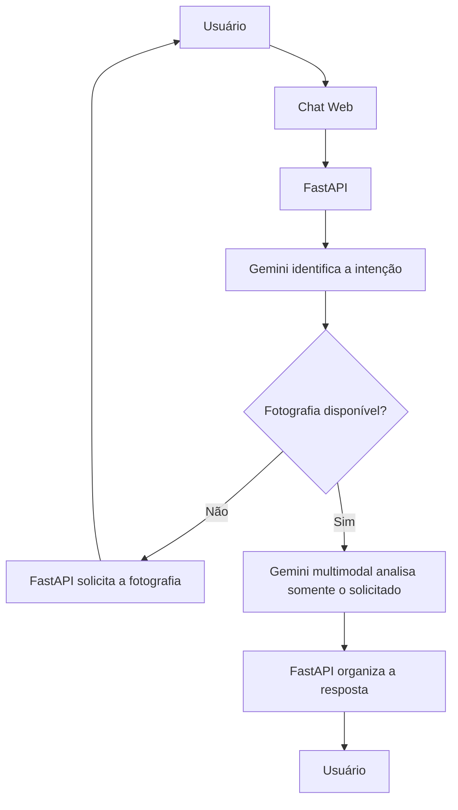

# Análise de Cabelo com LLM

Protótipo acadêmico que recebe mensagens em linguagem natural e fotografias para identificar características aparentes do cabelo. O sistema usa a API Gemini para interpretar o pedido e analisar visualmente a imagem.

Demonstração publicada:  
https://ldsgreccoia.com.br/analise-cabelo-llm/

Repositório GitHub:  
https://github.com/ldsgrecco/analise-cabelo-llm

## Objetivo da atividade

Este protótipo foi desenvolvido para:

- receber uma mensagem em linguagem natural;
- identificar a intenção do usuário;
- extrair as informações necessárias;
- consultar um serviço externo quando necessário;
- solicitar informações adicionais quando a mensagem estiver incompleta;
- gerar uma resposta final sem inventar dados.

## Intenção escolhida

**Identificar o comprimento aparente do cabelo a partir de uma fotografia.**

Como extensão do protótipo, também foi implementada a identificação da textura aparente, permitindo que o usuário solicite comprimento, textura ou ambos.

Para o comprimento, as categorias possíveis são:

- curto;
- médio;
- longo;
- extralongo.

Para a textura aparente, as categorias possíveis são:

- lisa;
- ondulada;
- cacheada;
- crespa.

## Relação com a proposta inicial

Na proposta inicial, eu pretendia incorporar a LLM ao projeto Espelho Virtual para analisar comprimento, textura, volume e sinais visuais de coloração.

Durante o desenvolvimento, percebi que seria mais adequado manter esta atividade como um protótipo acadêmico separado, sem alterar o funcionamento do Espelho Virtual. Por isso, defini o comprimento aparente como intenção principal desta atividade e mantive a textura aparente como uma extensão do protótipo. Volume e sinais de coloração permanecem como possibilidades para uma etapa futura.

## Arquitetura

O projeto possui duas partes:

- `frontend/`: interface web em HTML, CSS e JavaScript;
- `backend/`: API em Python com FastAPI.

Fluxo da aplicação:



A intenção identificada é mantida durante a conversa. Assim, quando a fotografia estiver faltando, o sistema solicita a imagem e continua o pedido anterior após o envio, sem exigir que a pessoa repita a mensagem.

## Tecnologias utilizadas

- Python 3.12
- FastAPI
- Google Gemini API
- HTML, CSS e JavaScript
- Nginx no ambiente publicado

## Prompt utilizado

### Interpretação da mensagem

O backend utiliza o seguinte modelo de instrução para identificar a intenção:

```text
Você interpreta mensagens de um chat acadêmico de análise de cabelo.

A pessoa pode querer descobrir:
- "comprimento"
- "textura"
- ambos

Considere que o assunto permanente da conversa é cabelo. Entenda linguagem informal,
perguntas curtas e erros de grafia. Não responda ao usuário; devolva SOMENTE JSON válido.

Exemplos:
"q tamaho ta meu cabelo?" -> {"intents":["comprimento"]}
"ele é caxeado ou lizo?" -> {"intents":["textura"]}
"como ele é?" -> {"intents":["comprimento","textura"]}
"quero saber de tudo" -> {"intents":["comprimento","textura"]}
"qual a cor do meu olho?" -> {"intents":[]}

Mensagem: {message!r}
```

### Análise da fotografia

Depois que a intenção foi identificada e a fotografia está disponível, o backend utiliza o seguinte modelo de instrução para a análise visual:

```text
Você é um assistente acadêmico de análise visual de cabelo.
Analise exclusivamente estes aspectos aparentes na fotografia:
- comprimento: curto, médio, longo ou extralongo
- textura: lisa, ondulada, cacheada ou crespa

A pessoa solicitou: {requested}.

Responda SOMENTE JSON válido, sem markdown, no formato:
{
  "comprimento": "curto|médio|longo|extralongo|null",
  "textura": "lisa|ondulada|cacheada|crespa|null"
}

Preencha apenas o que foi solicitado. Se não houver segurança visual suficiente,
use null. Não faça diagnóstico capilar, não invente características e não cite
informações fora da fotografia.
```

## Estrutura de arquivos

```text
analise-cabelo-llm/
├── backend/
│   ├── .env.example
│   ├── main.py
│   └── requirements.txt
├── frontend/
│   ├── app.js
│   ├── index.html
│   └── style.css
├── docs/
├── .gitignore
└── README.md
```

## Como executar localmente

### 1. Criar o ambiente virtual

```bash
cd backend
python3 -m venv .venv
source .venv/bin/activate
```

### 2. Instalar as dependências

```bash
pip install -r requirements.txt
```

### 3. Configurar a chave da API

Copie o arquivo `.env.example` para `.env` e informe sua chave da API Gemini:

```bash
cp .env.example .env
nano .env
```

O arquivo `.env` deve conter:

```text
GEMINI_API_KEY=sua_chave_da_api_gemini_aqui
```

A chave não deve ser enviada ao repositório.

### 4. Iniciar a API

```bash
uvicorn main:app --host 0.0.0.0 --port 8001
```

A API ficará disponível em `http://127.0.0.1:8001`.

## Testes realizados

| Tipo de teste | Mensagem enviada | Condição | Resultado |
|---|---|---|---|
| Informação faltando | `Quero saber o comprimento do meu cabelo.` | Sem fotografia | Reconheceu o pedido de comprimento, solicitou a fotografia e não gerou classificação sem evidência visual. |
| Linguagem informal e erro de escrita | `q tamaho ta meu cabelo?` | Sem fotografia | Interpretou `tamaho` como `tamanho`, reconheceu o pedido de comprimento e solicitou a fotografia. |
| Mensagem completa | `quero os 2` | Com fotografia anexada | Interpretou o pedido como comprimento e textura e retornou comprimento médio e textura cacheada para a fotografia utilizada no teste. |

Os testes também foram registrados por meio de capturas de tela e estão organizados no relatório entregue na pasta `docs/`.

Além dos três testes obrigatórios, foi registrado um teste adicional de indisponibilidade da API, no qual o sistema informa a limitação temporária sem criar uma classificação visual fictícia.

## Dificuldades encontradas

- A API Gemini possui limites de uso no plano gratuito e pode retornar indisponibilidade temporária.
- Fotografias com pouca iluminação, cabelo oculto ou enquadramento insuficiente podem impedir uma classificação segura.
- Foi necessário tratar mensagens informais e com erros de escrita para tornar a interação mais natural.
- Foi necessário manter a intenção identificada quando a fotografia era enviada em uma mensagem posterior.

## Possíveis melhorias

- Criar uma API própria de visão computacional, reduzindo a dependência de serviços externos.
- Registrar histórico de análises em banco de dados.
- Permitir que a pessoa avalie a resposta recebida.
- Ampliar os testes com diferentes tipos de fotografia e variações de linguagem.

## Relatório da entrega

O relatório completo, com a demonstração visual dos testes, está disponível em:

[Relatorio_de_Testes_Analise_de_Cabelo_LLM.docx](docs/Relatorio_de_Testes_Analise_de_Cabelo_LLM.docx)

## Limitação ética

As classificações são visuais e destinadas exclusivamente a fins acadêmicos. Elas não substituem avaliação profissional de cabeleireiro ou dermatologista.
